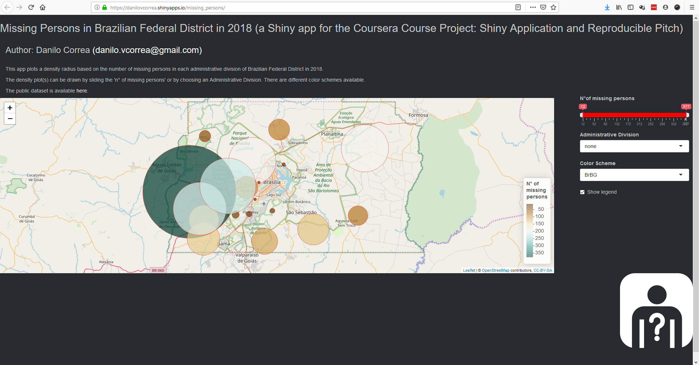

<style>
body {
    overflow: scroll;
}
</style>

Missing Persons in Brazilian Federal District in 2018 (a Shiny app for the Coursera Course Project: Shiny Application and Reproducible Pitch)
========================================================
author: Danilo Correa
date: October 3, 2019
autosize: true

2 - Shiny app documentation
========================================================

- This app plots a density radius based on the number of missing persons in each administrative division of Brazilian Federal District in 2018.
- The density plot(s) can be drawn by sliding the 'n° of missing persons' or by choosing an Administrative Division. There are different color schemes available.
- The public dataset is available here <http://www.dados.df.gov.br/dataset/por-regiao-administrativa/resource/48f9e674-d198-4b7d-bd83-0eea9516d687>

3 - ui
========================================================


```r
library(shiny)
library(shinythemes)
library(shinyWidgets)
library(leaflet)
library(RColorBrewer)


missing.df <- read.csv(file = "data/missing.df.csv", encoding = "UTF-8")

ui <- bootstrapPage(
    theme = shinytheme("slate"),
    titlePanel("Missing Persons in Brazilian Federal District in 2018 (a Shiny app for the Coursera Course Project: Shiny Application and Reproducible Pitch)"),
    mainPanel(h3(span("Author: Danilo Correa"),a("(danilo.vcorrea@gmail.com)", href = "mailto:daattali@gmail.com")),
              br(),
              p("This app plots a density radius based on the number of missing persons in each administrative division of Brazilian Federal District in 2018."),
              p("The density plot(s) can be drawn by sliding the 'n° of missing persons' or by choosing an Administrative Division. There are different color schemes available."),
              p("The public dataset is available", a(href="http://www.dados.df.gov.br/dataset/por-regiao-administrativa/resource/48f9e674-d198-4b7d-bd83-0eea9516d687", "here."))
    ),
    setSliderColor("red", 1),
    chooseSliderSkin("Flat"),
    tags$style(type = "text/css", "html, body {width:100%;height:100%}"),
    leafletOutput("map", width = "80%", height = "50%"),
    img(src = "missing_neg.png", style="float:right"),
    absolutePanel(top = 220, right = 10,
                  sliderInput("range", "N°of missing persons", min(missing.df$missing), max(missing.df$missing),
                              value = range(missing.df$missing),  
                              dragRange = TRUE, ticks = TRUE
                  ),
                  selectInput(
                      inputId = "county",
                      label = "Administrative Division",
                      choices = c("none", paste(missing.df$county))),
                  selectInput("colors", "Color Scheme",
                              rownames(subset(brewer.pal.info, category %in% c("seq", "div")))
                  ),
                  checkboxInput("legend", "Show legend", TRUE), style="z-index:500;", draggable = TRUE 
    )
)
```

4 - server
========================================================


```r
server <- function(input, output, session) {
    
    # n° of missing persons:
    filteredData <- reactive({
        missing.df[missing.df$missing >= input$range[1] & missing.df$missing <= input$range[2],]
    })
    
    # county:
    filteredData2 <- reactive({
        missing.df[missing.df$county == input$county,]
    })
    
    # color pallete:
    colorpal <- reactive({
        colorNumeric(input$colors, missing.df$missing)
    })
    
    # Leaflet map:
    output$map <- renderLeaflet({
        leaflet(missing.df) %>% addTiles() %>%
            fitBounds(~min(long), ~min(lat), ~max(long), ~max(lat))
    })
    
    # Incremental changes to the map:
    # addCircles by n° of missing persons:
    observe({
        pal <- colorpal()
        
        leafletProxy("map", data = filteredData()) %>%
            clearShapes() %>%
            addCircles(radius = ~50*missing, weight = 1, color = "red",
                       fillColor = ~pal(missing), fillOpacity = 0.7, popup = ~paste(county,": ", missing, sep = "")
            )
    })
    # addCircles by county:
    observe({
        pal <- colorpal()
        
        leafletProxy("map", data = filteredData2()) %>%
            clearShapes() %>%
            addCircles(radius = ~50*missing, weight = 2, color = "red",
                       fillColor = ~pal(missing), fillOpacity = 0.7, popup = ~paste(county,": ", missing, sep = "")
            )
    })
    
    # addLegend by n° of missing persons:
    observe({
        proxy <- leafletProxy("map", data = missing.df)
        proxy %>% clearControls()
        if (input$legend) {
            pal <- colorpal()
            proxy %>% addLegend(position = "bottomright",
                                pal = pal, values = ~missing, title = "N° of <br> missing <br> persons"
            )
        }
    })
    img(src='missing_neg.png', width = 170, height = 170, style="display: block; float: right;")
}

shinyApp(ui, server)
```

5 - Loaded app
========================================================



